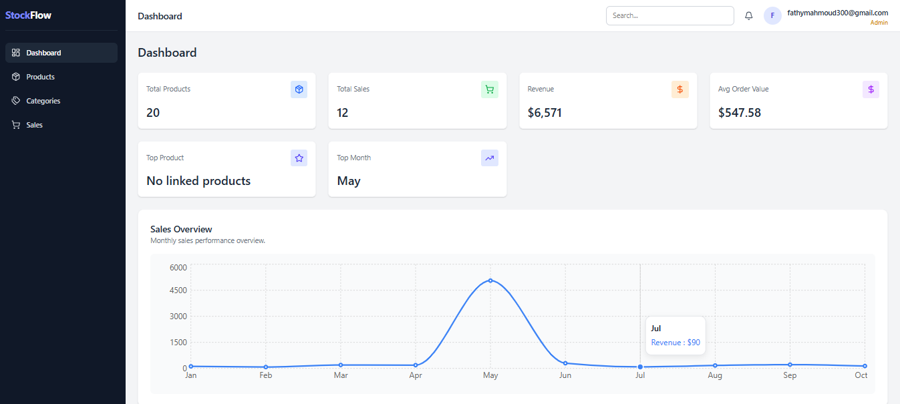

# StockFlow Admin Dashboard

A professional admin dashboard for managing products, categories, and sales.

## Features

- Interactive analytics dashboard
- Product and category management
- Sales monitoring and KPIs
- Search, filter, sort, and pagination
- Responsive sidebar and navigation
- Form validation with Zod
- Loading, empty, and error states
- Products management
- Categories management
- Sales tracking
- Search / Filter / Sort
- Responsive layout
- Charts and KPIs
- Loading / Error / Empty states

## Tech Stack

- React
- Vite
- Tailwind CSS
- React Router
- Context API
- Axios
- React Hook Form
- Zod
- Recharts
- Lucide React

## Preview

### Dashboard


## Architecture

- Reusable UI components
- Context-based state management
- Organized services and hooks structure
- Scalable folder architecture

## Live Demo

[Live Demo](https://stock-flow-nine-bice.vercel.app/login)

## Installation

```bash
npm install
npm run dev
```
